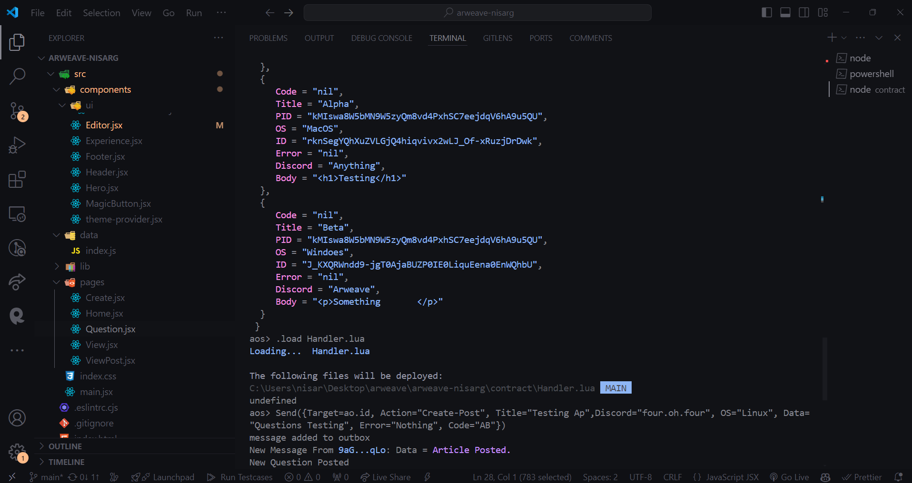

# ArweaveQuery
## Checkout the App: https://arweave-project.vercel.app/
## Demo of the Project

https://github.com/Nishu0/arweave-project/assets/89217455/5d17d9e6-1083-4b18-b72f-ccdeefc7c0ad

A project for the Arweave India Hacker House Dev and Design by Nisarg Thakkar

## About Project

ArweaveQuery is your go-to platform for all things Arweave, where you can ask detailed questions, engage with the community, and find the best solutions to your queries. Users can post questions, providing a space for in-depth discussions and expert advice. You can like and dislike posts to signal the most helpful contributions, ensuring high-quality content rises to the top. Highlight your favorite answers to quickly reference the most valuable insights, making ArweaveQuery an indispensable resource for anyone looking to master Arweave technology.

## Features

### Developer Support

Get round-the-clock support from experienced Arweave developers. Whether you're troubleshooting code, integrating Arweave into your project, or exploring new features, our dedicated team is here to help you every step of the way.

### Community Updates

Never miss an update with real-time news and insights from the Arweave community. Stay connected with the latest developments, network with peers, and participate in discussions to keep your knowledge up-to-date.

### Highlight Best Solutions

Find answers to all your Arweave-related questions and highlight the right one. Get detailed, expert-driven answers to your queries, helping you to implement best practices and innovate with confidence.

### How to Connect dbAdmin and Create Tables in AOS Terminal

### How to Execute Handlers Logic with AOS Terminal 

## :mailbox_with_mail: Get in touch!

 
 
  Made with :coffee: and ❤️ by <b>Nisarg Thakkar</b>.

